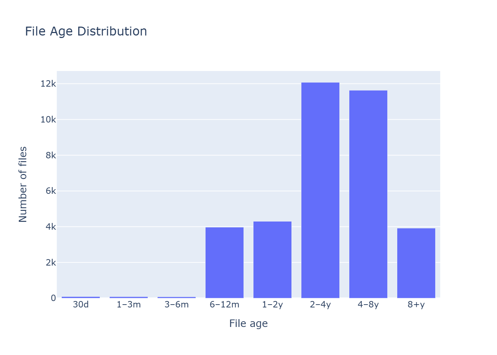
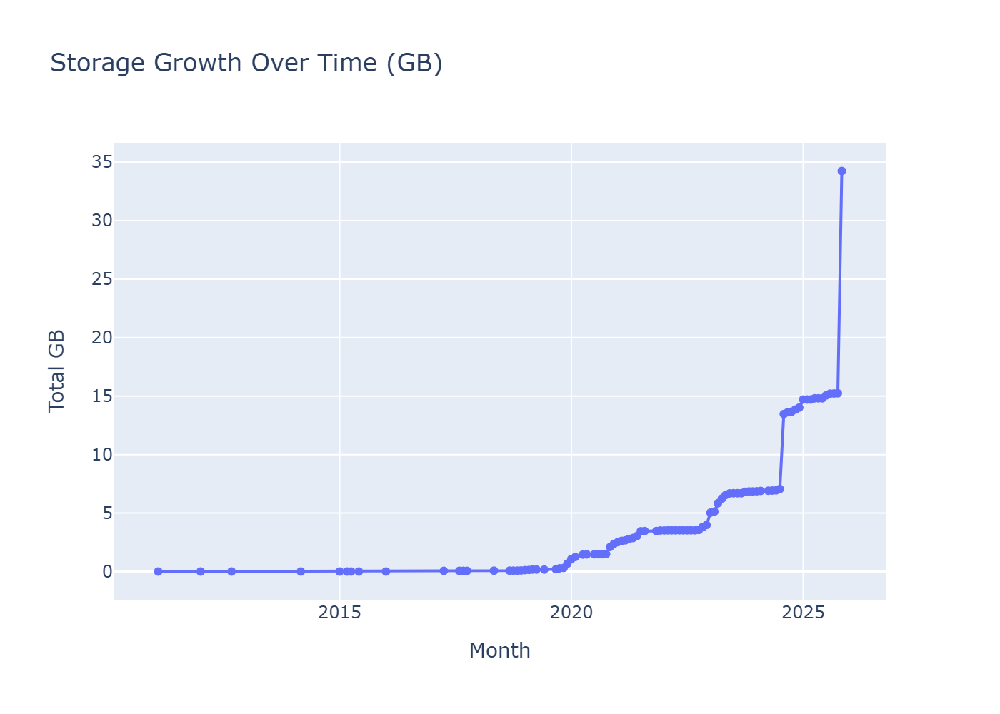
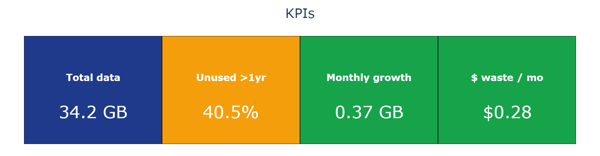
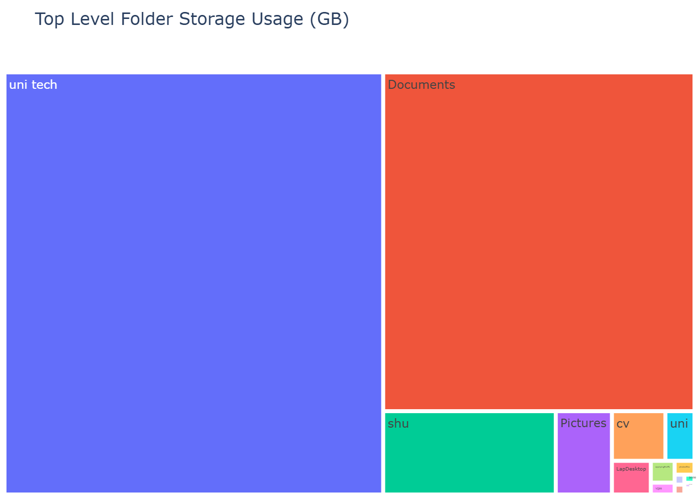

# Data Landfill Demo - Personal Storage Proof of Concept
## Executive Summary
This demo shows how an organisation can **see**, **contrl**, and **automate** its data estate instead of letting it grow unchecked.
Using my personal cloud storage as a stand-in for an enterpise environment, I analysed how data grows, how much of it is unused, and where waste accumulates - then turned that into visual insight and automation opportunities.

The exact data shown is personal, but the behaviour is universal.

## The Business Problem
Most organisations don't have a "storage" problem - they have a **_visibility_** problem.

Data grows quietly through:
- Repeated copies of files
- Old documents nobody opens again
- Folders with no clear owner
- Data that is never cleaned up

Over time this creates a "data landfill":
- Rising storage costs
- Increased compliance risk
- Slower working practices
- No clear understanding of what is valuable and what is waste
  
## What This Demo Does
The proof-of-concept answers three questions:
- **What do we actually have?**
- **What is still being used?**
- **What is quietly wasting money and increasing risk?**
It scans file metadata and presentes insight visually so that action becomes obvious.

> [!NOTE]
> The dataset used within has been kept private - as this repository is public. To see a snippet please contact me directly.

## Key Metrics Snapshot

### What this shows
The majority of the files are several years old, with large spikes between 2-8 years, <u>Very little</u> data is new.

### What this means in plain English
Most of the data exists, but isn't actively used.

### Enterprise Comparison
In an organisation, this usually indicates:
- Legacy projects still consuming storage
- Forgotten data with no owner
- Compliance risk from unmanaged records
> This chart identifies where automated archiving or deletion policies would deliver immediate value.

## Storage Growth Over Time

### What this shows
Growth is not steady - it happens in bursts.
Large jumps indicate periods when substantial data was introduce at once.

### What this means
Data does not grow gradually - it grows when something changes:
- New project
- New role
- System migration
- Tool adoption

### Enterprise Comparison
For an organisation, this enables:
- Forecasting storage spend
- Identifying departments creating spikes
- Alerting on abnormal growth
> In production, this becomes an automated alert instead of reactive firefighting.

## KPI Summary

### What this shows (from this dataset)
- Total data: **34.2 GB**
- Unused > 1 Year: **40.5%**
- Monthly growth: **0.37 GB**
- Estimated waste: **$0.28 / month**

### What this means
Even on a small dataset:
- Nearly half of the data has no current value
- Growth continues quietly
- Waste compounds over time

### Enterprise Comparison
Scale this to a business:
- 34 GB -> 34 TB
- $0.28 -> thousands per month
- 40% waste -> entire storage tiers being irrelevant
> This is what executive dashboards should show: not just storage - _impact_.

## Top-Level Folder Storage

### What this shows
Two folders dominate usage:
- `uni tech`
- `Documents`
Everything else is marginal

### What this shows
A small number of areas consume most space.

### Enterprise Comparison
In an organisation:
- This identifies **teams/data owners**
- Drives targeted cleanup
- Enables accountability instead of guessing
> This chart tells leadership where to act first - not where to look blindly.

## Conclusion
Taken together, these charts shwo a familiar pattern:
Most data is old, growth is uneven, a small number of areas dominate usage, and waste is invisible without measurement.

Although this dataset is personal, the behaviour is not. At enterprise scale, the same patterns appear - multiplied by departments, systems and years of unmanaged growth.

If I were tackling a real "**_data landfill_**" problem, this type of view would be one of my first steps. Not to analyse files, but to create decision-making clarity:
Where the risk is, where the cost is, and where automation should start.

Until data becomes visible, it cannot be governed.
And until it is governed, it will only grow - quietly, expensively, and without ownership.

